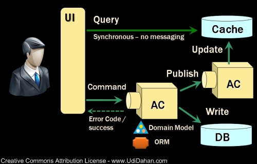

领域驱动设计DDD（Domain Drive Design）是一种“新的”软件设计模式， 2003年由Eric Evans提出，用来解决复杂系统的复用性和扩展性无法得到保证的问题。

### DDD中的核心要素
- 实体（Entity），具备唯一ID，具备业务逻辑，对应现实世界业务对象（比如：某个人有唯一的身份证号）
- 值对象（Value Object)，不具有唯一ID，由对象的属性，一般为内存中的临时对象，可以用来传递参数或对实体进行补充描述（比如：金额，由币值和货币单位组成）
- 领域服务（Domain Service)，为上层提供可操作的接口，负责对领域对象进行封装和调度，一般存在于需要调用基础设施的业务逻辑中（比如：支付服务，下单服务）。
- 聚合根（Aggregate Root)，聚合根属于实体对象，聚合根具有全局唯一ID，实体只有在聚合根内部有唯一ID，值对象没有ID，值对象和实体都属于某一个聚合根（比如：订单是聚合根，包含商品实体和地址值对象）。
- 工厂（Factory)，主要用来创建聚合根，一般在复杂的聚合根构建时会用到。
- 仓储（Repository)，封装基础设施提供查询和持久化聚合根操作。

POP: 面向过程编程，无边界，需求分解成方法（函数）
OOP: 面向对象编程，以对象为边界，需求分解成对象
DDD: 领域驱动设计，以问题域为边界，需求分解成问题域，再分解成对象

DDD是为解决软件复杂性而诞生，与OOP最大的区别就是划分边界的方式不一样

### CQRS
CQRS (Command Query Resource Sync)

Command
Query

### 案例

##### 需求
我们先看一个简单的案例需求如下：
用户可以通过银行网页转账给另一个账号，支持跨币种转账。
同时因为监管和对账需求，需要记录本次转账活动。

##### 分析
拿到这个需求之后，一个开发可能会经历一些技术选型，最终可能拆解需求如下：

1、从MySql数据库中找到转出和转入的账户，选择用 MyBatis 的 mapper 实现 DAO；
2、从 Yahoo（或其他渠道）提供的汇率服务获取转账的汇率信息（底层是 http 开放接口）；

3、计算需要转出的金额，确保账户有足够余额，并且没超出每日转账上限；

4、实现转入和转出操作，扣除手续费，保存数据库；

5、发送 Kafka 审计消息，以便审计和对账用；

事物脚本代码
问题1-可维护性能差
一个应用最大的成本一般都不是来自于开发阶段，而是应用整个生命周期的总维护成本，所以代码的可维护性代表了最终成本。
问题2-可拓展性差

事务脚本式代码的第二大缺陷是：虽然写单个用例的代码非常高效简单，但是当用例多起来时，其扩展性会变得越来越差。

可扩展性 = 做新需求或改逻辑时，需要新增/修改多少代码

问题3-可测试性能差

我们重新来分析一下为什么以上的问题会出现？因为以上的代码违背了至少以下几个软件设计的原则：

单一性原则（Single Responsibility Principle）：单一性原则要求一个对象/类应该只有一个变更的原因。但是在这个案例里，代码可能会因为任意一个外部依赖或计算逻辑的改变而改变。
依赖反转原则（Dependency Inversion Principle）：依赖反转原则要求在代码中依赖抽象，而不是具体的实现。在这个案例里外部依赖都是具体的实现，比如YahooForexService虽然是一个接口类，但是它对应的是依赖了Yahoo提供的具体服务，所以也算是依赖了实现。同样的KafkaTemplate、MyBatis的DAO实现都属于具体实现。
开放封闭原则（Open Closed Principle）：开放封闭原则指开放扩展，但是封闭修改。在这个案例里的金额计算属于可能会被修改的代码，这个时候该逻辑应该需要被包装成为不可修改的计算类，新功能通过计算类的拓展实现。

### 代码落地

整洁架构

六边形架构

洋葱架构
