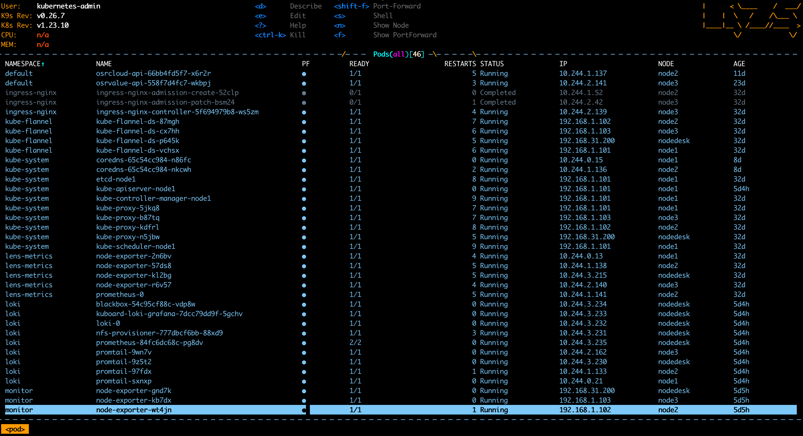

## 客户端工具
本文主要讲一下我这些年用的一些k8s的工具，以及使用的一些感受。

### kubectl
k8s默认的管理工具还是kubectl， 其他很多工具的实现都是基于kubectl的基础上实现的。
##### 配置
1. kubectl默认读取～/.kube/config的配置， 所以客户端需要copy k8s集群的配置到本地，并放到～/kube/config中， 
*注意： 每个用户需要单独放一个配置文件*
##### 别名
1. 每次都输入kubectl 命令显的很臃肿， 可以.bashrc/ .zshrc中配置别名 `alias k=kubectl`
2. 如果有多个集群需要管理，也可以使用别名来解决： 将集群配置放置在任意位置， 我这里放在 ～/.kube/config_club 
然后配置别名`alias kc=kubectl --kubeconfig=~/.kube/config_club`
##### 常用的命令
- `k get pod`: 查询pod，默认是default命名空间，可以通过-n <namespce>指定命- 名空间 
- `k get pod -A`: 查询所有空间的pod 
- `k get pod -o wide`: 查询pod并且带有node信息
- `k get deploy`: 查询deployment
- `k get svc`: 查询service
- `k get ingress`: 查询ingerss
- `k get cm ` 查询配置列表
- `k get cm config1 -oyaml`: 使用yaml格式查询config1 , `- ojson`使用- json格式
- `k edit cm config1 -oyaml` : 编辑congfig1，保存后会自动生效。
- `k describe pod <pod name>`: 查看pod描述，pod启动出错时查看错误信息。
- `k logs <pod name>`: 查看pod日志， pod启动后可以查看。 加上`-f`后可以监- 听日志变化并实时输出。
- `k exec -it <pod name> -- bash`: 进入pod容器中，用来查看pod容器的一些文- 件信息。有些镜像比较精简，没有bash工具，可以尝试用sh。
- `k cp <namespace>/<pod name>:/etc/resolv.conf ./resolv.conf`: 将文- 件从pod中拷贝到本地，解决一些pod中没有bash和sh， 无法查看pod内的文件临时验证- 的问题。
- `k scale --replicas=1 deploy <deployment>`: 动态扩容/缩小- deployment。
- `kubectl create secret docker-registry docker-registry --docker-server=<server> --docker-username=<username> --docker-password=<password>`: 创建docker-registry secret
- `k api-resources`: 查看所有k8s的资源列表

### k9s
k9s是一个k8s客户端cli工具，可以在命令行视图来查看k8s的pod运行情况
1. 查看pod运行情况
2. 查看日志，执行tail, head，固定时间刷新等
3. 支持快速进入pod执行shell
4. 支持pod端口转发
5. 支持编辑yaml
##### 安装
mac
```bash
brew install k9s
```
ubuntu
```bash 
snap install k9s
```
其他环境后续再补充

##### 使用
命令行直接执行`k9s`就可以打开所有pod视图, 如果需要指定配置文件可以使用`k9s --kubeconfig <path>`指定配置文件

命令说明
- 0 : 所有pod
- 1 : default命名空间
- \<ctrl-d> : 删除pod
- d : 进入描述
- l : 查看log
- s : 进入shell
- \<shift-f> : 端口转发
- y : 打开配置文件

### Lens
Lens 是为那些每天使用 Kubernetes 的人设计的 IDE。它可以探索和导航 Kubernetes 集群，而无需学习 kubectl 命令，实时检查实时统计信息、事件和日志流。
它将所有集群、服务、工作负载、工具、自动化和相关资源整合在一起，以便于访问。Lens 与 Prometheus 集成，可视化并查看资源使用指标的趋势，包括 CPU、内存、网络和磁盘，以及总容量、实际使用情况、请求和限制。每个 k8s 资源都会自动生成详细的可视化信息。
Lens 带有 Helm 图表管理，允许发现和快速部署数千个公开可用的 Helm 图表并管理自己的存储库。浏览已安装的 Helm 图表及其修订版，只需单击一下即可升级。
Lens 是适用于 MacOS、Windows 和 Linux 操作系统的独立应用程序。

跳转：[lens github](https://github.com/lensapp/lens)

### Kuboard
 Kuboard，是一款免费的 Kubernetes 图形化管理工具，Kuboard 力图帮助用户快速在 Kubernetes 上落地微服务。


 #### 使用
 kuboard  现在有两个版本v2和v3， 我之前主要用的v2版本（使用的时候v3还没有出来），安装简单，基本上一个命令可以安装完成。
```bash
kubectl apply -f https://kuboard.cn/install-script/kuboard.yaml
kubectl apply -f https://addons.kuboard.cn/metrics-server/0.3.7/metrics-server.yaml
```

获取token
<!-- tabs:start -->
#### **管理员用户**
```
echo $(kubectl -n kube-system get secret $(kubectl -n kube-system get secret | grep ^kuboard-user | awk '{print $1}') -o go-template='{{.data.token}}' | base64 -d)
```
#### **只读用户**
```bash
echo $(kubectl -n kube-system get secret $(kubectl -n kube-system get secret | grep ^kuboard-viewer | awk '{print $1}') -o go-template='{{.data.token}}' | base64 -d)

```

#### 访问Kuboard

Kuboard Service 使用了 NodePort 的方式暴露服务，NodePort 为 32567；您可以按如下方式访问 Kuboard。
```
http://任意一个Worker节点的IP地址:32567/
```
<!-- tabs:end -->

### KubeSpare
KubeSphere 是在 Kubernetes 之上构建的面向云原生应用的分布式操作系统，完全开源，支持多云与多集群管理，提供全栈的 IT 自动化运维能力，简化企业的 DevOps 工作流。它的架构可以非常方便地使第三方应用与云原生生态组件进行即插即用 (plug-and-play) 的集成。

KubeSpare也是提供了一种web管理界面，在页面上可以完成大多数kubectl的操作，提供一种可视化的操作界面，这个我也是最近刚用，和kuboard主要功能差不多。

网站跳转： [kubespare官网](https://kubesphere.io/zh/)