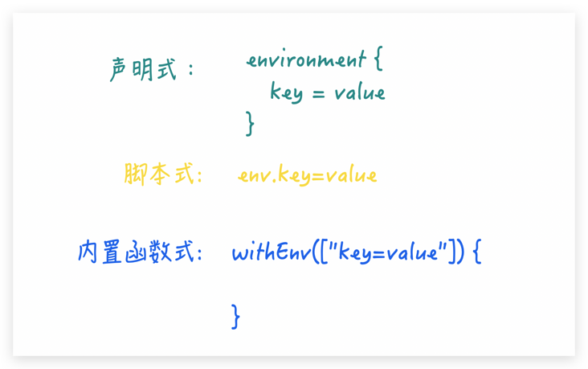

查看 Jenkins 系统内置环境变量
方法一：
${YOUR_JENKINS_HOST}/env-vars.html

方式二：
通过执行 printenv shell 命令来获取：
```
pipeline {
    agent any

    stages {
        stage("Env Variables") {
            steps {
                sh "printenv"
            }
        }
    }
}
```

读取环境变量
上面我们说了 env 是环境变量的关键字，但是读取 Jenkins 内置的这些环境变量，env 关键字是可有可无, 但不能没了底裤，都要使用 ${xxx} 包围起来。以 BUILD_NUMBER 这个内置环境变量举例来说明就是这样滴：

自定义 Jenkins 环境变量
Jenkins pipeline 分声明式（Declarative）和 脚本式（imperative）写法，相应的环境变量定义方式也略有不同，归纳起来有三种方式：


```
pipeline {
    agent any

    environment {
        FOO = "bar"
    }

    stages {
        stage("Custom Env Variables") {
            environment {
                NAME = "RGYB"
            }

            steps {
                echo "FOO = ${env.FOO}"
                echo "NAME = ${env.NAME}"

                script {
                    env.SCRIPT_VARIABLE = "Thumb Up"
                }

                echo "SCRIPT_VARIABLE = ${env.SCRIPT_VARIABLE}"

                withEnv(["WITH_ENV_VAR=Come On"]) {
                    echo "WITH_ENV_VAR = ${env.WITH_ENV_VAR}"
                }
            }
        }
    }
}
```
