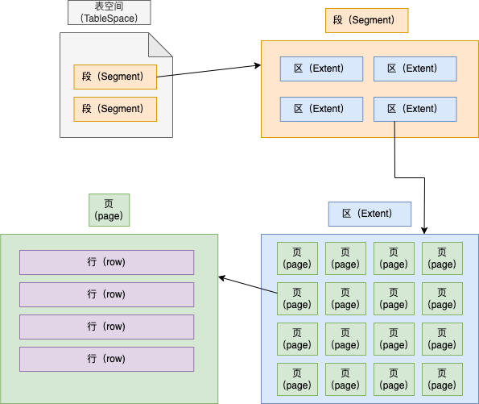
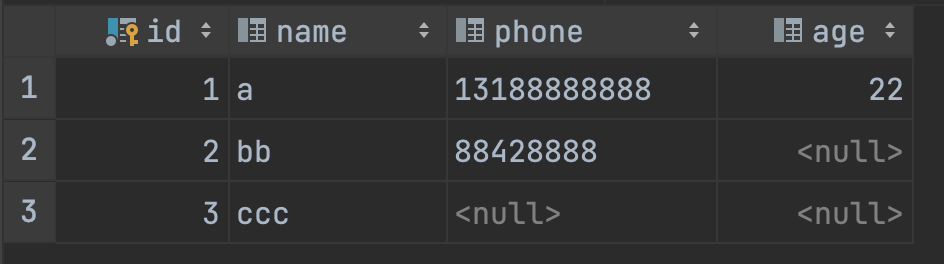
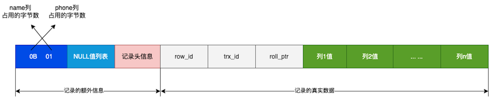
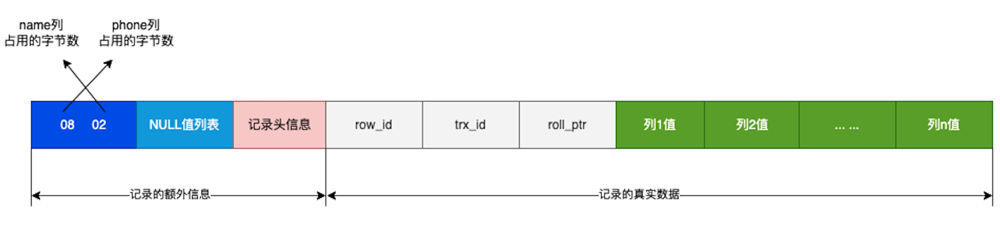
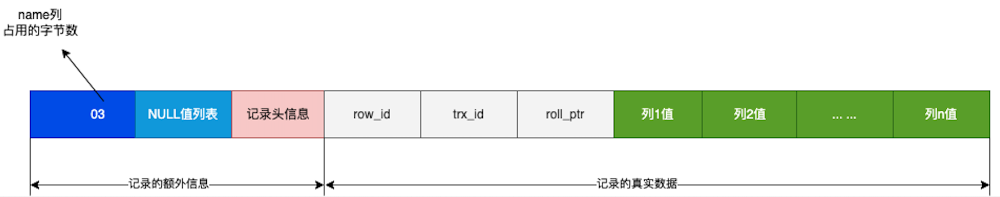
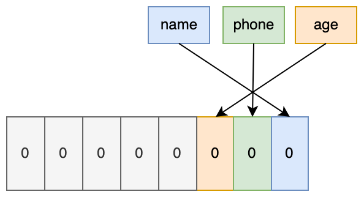
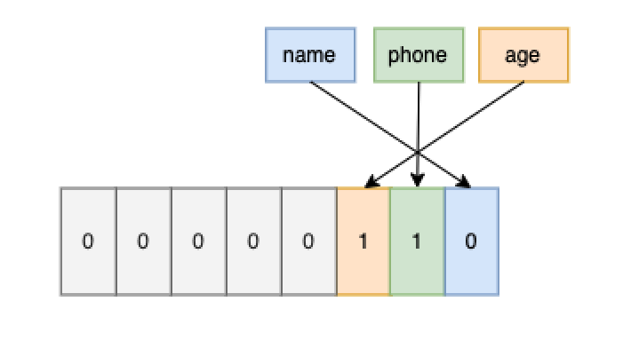
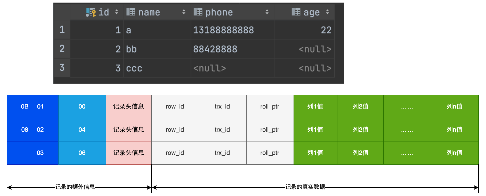
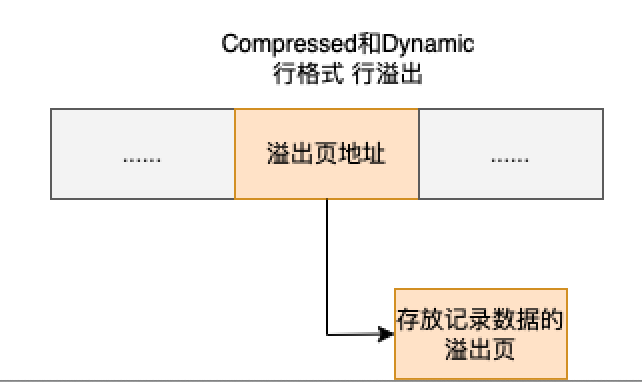

## Mysql一行数据是如何存储的？

Mysql的数据是存储在磁盘的，具体是存储在哪个文件呢？
Mysql 存储行为是有存储引擎实现的，Mysql支持多中存储引擎，不同的存储引擎自然保存的文件也不同。

InnoDB是我们常用的存储引擎，也是MySQL默认的存储引擎。所以，本文都是以InnoDB展开讨论

看看MySQL的存储位置
```bash
mysql> show variables like 'datadir';
+---------------+-------------------+
| Variable_name | Value             |
+---------------+-------------------+
| datadir       | /data/mysql/data/ |
+---------------+-------------------+
1 row in set (0.00 sec)
```
每创建一个数据就会在`/data/mysql/data`下创建一个以database为名的目录，然在保存表结构和表数据的文件都会存放在该目录。

比如，我创建了一个my_test的database，并且在该database里创建了一个t_order的表。
```
mysql> use my_test;
Database changed
mysql> show tables;
+-------------------+
| Tables_in_my_test |
+-------------------+
| t_order           |
+-------------------+
1 row in set (0.01 sec)
```
然后我们看看`/data/mysql/data/my_test`下到底有什么文件？
```
[root@node1 my_test]# ls /data/mysql/data/my_test/
t_order.ibd
```

t_order.ibd，t_order 的表数据会保存在这个文件。表数据既可以存在共享表空间文件（文件名：ibdata1）里，也可以存放在独占表空间文件（文件名：表名字.ibd）。这个行为是由参数 innodb_file_per_table 控制的，若设置了参数 innodb_file_per_table 为 1，则会将存储的数据、索引等信息单独存储在一个独占表空间，从 MySQL 5.6.6 版本开始，它的默认值就是 1 了，因此从这个版本之后， MySQL 中每一张表的数据都存放在一个独立的 .ibd 文件。

我们知道一张数据库表的数据保存在[表名.ibd]文件中，这个文件也称为独占表空间文件。

### 表空间文件的结构是怎么样的？
表空间文件是有段（segment）、区（extent）、页（page）、行（row）组成, InnoDB存储引擎的存储结构大致如下：



1. 行
数据库表中的数据都是按行（row）进行存放的，每行记录根据不同的行格式，有不同的存储结构。
2. 页（Page）
记录是按照行来存储的，单是数据库的读取并不是以【行】为单位， 否则一次读取（一次I/O操作）只能处理一行数据，效率会非常低下。
因此InnoDB的数据是按【页】为单位来读写的，也就是说，当需要读取一条记录时，并不是将行记录从磁盘读出来，而是以页为单位，整体读入内存。

默认InnoDB存储引擎页大小为16KB，也就是最多能保证16KB的连续存储空间。

3. 区（extent)

B+树是通过双向链表连接两个页的，但是页的存储大小只有16KB，这样就只能保证只有16KB的连续存储空间，页和页之间是不连续的，这样就导致数据查询时磁盘IO压力比较大。

如果数据量大的时候MySQL就会分配区大小的存储空间，连续64个页组成一个区， 这样一个区就有1M大小，这样就能保证相邻页在物理存储上时连续的，就能使用连续IO了。

在范围查询时的性能就会很高。

4. 段（Segment）
表空间是由多个段组成，段分为：数据段、索引段、回滚段等
数据段： 存储B+树叶子结点的区的集合
索引段： 存储B+树非叶子结点的区的集合
回滚段： 存放的是回滚数据的区的集合

### InnoDB行的存储格式有哪些？
行格式（row_format）就是以行数据的存储结构
InnoDB提供了4种行格式，分布是Redudent、Compact、Dynamic和Compressed行格式。
- Redudent: MySQL5.0版本以前的存储格式，现在基本很少用了。由于Redudent不是一种紧凑的行格式，所以5.0版本以后引入了Compact格式。
- Compact: 是一种紧凑的行格式，设计的初衷是为了让一个数据页可以存储更多的行记录，从MySQL 5.1开始，默认的行格式就设置成了Compact
- Dynamic和Compressed也是紧凑的行格式，它们的存储结构和Compact差不多，知识在Compact基础上做了一些改进， MySQL 5.7版本以后默认的行格式设置成了Dynamic.

### Compact行格式长什么样？


#### 记录的额外信息
记录的额外信息包含3个信息： 变长字段长度列表、NULL值列表、记录头信息

1. 变长字段长度列表
varchar(n)和char(n)，char是定长的，varchar是变长的。变长字段实际存储的是数据是不固定的。
所以，在存储数据的时候，也要把数据占用的大小保存起来，存在【变长字段长度列表】里面，读取数据的时候才能根据这个【变长字段长度列表】去读取对应长度的数据。其他TEXT、BLOB等变长字段也是这么实现的。
我们创建一张表来说明变长字段长度列表是怎么存储变长字段的真实数据占用的字节数的。字符集使用ascii，所以一个字符占用一个字节
```sql
CREATE TABLE `t_user` (
  `id` int(11) NOT NULL,
  `name` VARCHAR(20) DEFAULT NULL,
  `phone` VARCHAR(20) DEFAULT NULL,
  `age` int(11) DEFAULT NULL,
  PRIMARY KEY (`id`) USING BTREE
) ENGINE = InnoDB DEFAULT CHARACTER SET = ascii ROW_FORMAT = COMPACT;
```
插入3条数据，我们来分析这3条记录的变长字段长度列表是怎么存储的。


先看第一条
name列的值为a，真实数据占用的字节数是1个字节，十六进制为0x01,
phone列的值为13111111111，真实数据占用的直接数是11个字节，十六进制是0x0b
id和age列不是变长字段，所以不用管

这些变长字段的真实数据占用的字节数是按照逆序存放的，所以变长字段长度列表里的内容为【0B01】,不是【010B】


使用同样的方法可以算出来第二条数据的变长字段列表内容为【0802】,


第三条记录中，phone列的值为NULL，NULL值是不会存储在行记录中记录的真实数据部分的。所以变长字段长度列表中不需要保存NULL值变长字段的长度，所以变长字段列表内容为【03】。

>为什么变长字段长度列表的信息要按照逆序存放？

因为记录的头信息中记录的下一个行记录的指针，指向下一条记录的【记录头信息】和【真实数据】之间的位置，这样的好处是向左读是记录的头信息，向右读是真实数据。
变长字段长度列表之所以要逆序存放，**是因为这样可以使位置靠前列的真实数据和数据对应的长度在同一个CPU Cache Line中，这样可以提高CPU缓存的命中率。**

同样的道理，NULL值也需要逆序存放。

>每个行记录中都必须有变长字段长度列表吗？

变长字段长度列表不是必须的
当数据表中不存在变长字段列的时候，比如全部都是int类型的字段，这个时候就没有变长字段长度列表了，因为没有必要，还不如节省空间。
所以，变长字段长度列表只存在有变长字段的时候。

>每个变长字段的「变长字段长度」需要用多少字节表示？

条件一：如果变长字段允许存储的最大字节数小于等于 255 字节，就会用 1 字节表示「变长字段长度」；
条件二：如果变长字段允许存储的最大字节数大于 255 字节，就会用 2 字节表示「变长字段长度」；


2. NULL值列表

表中的某些列可能为NULL值，如果把NULL值存储在真实数据列中会比较浪费空间，所以Compact行格式把这些值为NULL的列单独存储到NULL值列表中。NULL值列表存储也使用逆序存放。

如果存在允许NULL值的列，则每个列对应一个二进制位bit， 二进制位按照列的顺序逆序排列。
- 二进制位的值为1时，代表该列的值为NULL
- 二进制位的值为0时，代表该列的值不为NULL

NULL值列表必须用整个字节位来表示（1字节8位），如果二进制位个数不足整数个字节，则在高位补0。

还是以t_user表的这三条记录为例：
我们看看三条记录的Campact行格式中的NULL值列表是如何存储的。

先来看看第一条记录，第一条记录的所有列都有值，所以用二进制位来表示都位0.

InnoDB是用整数字节的二进制位表示NULL值列表的，不足8位的需要在高位补0，最终二进制表示如下图：

所以，最终用十六进制表示为：0x00

第二条记录中的phone列的值为NULL，用二进制位1表示，其他列的NULL值二进制位用0表示， 所以最终用十六进制表示为：0x04


第三条记录中的phone和age列的值都位NULL，所以用十六进制表示为：0x06


三条记录的NULL值列表都填充完毕后，行格式如下图


NULL值表不是必须的， **当数据表的所有列都定义为NOT NULL时，这时候表里的行记录中就不会有NULL值列表**
所以在设计表的时候，通常建议将字段设置为NOT NULL, 这样可以节省至少1个字节的存储空间。

NULL值列表的空间不是固定为1字节的。
如果一个记录中有9个字段设置为NULL，那么就会创建2个字节的NULL值列表，如果如果17个NULL值字段，就会创建3个字节的NULL值列表，以此内推。


3. 记录头信息
记录头信息中包含很多信息，列举几个比较重要的
- delete_mask: 标记该条数据是否被删除。从这里可以看出来delete删除记录的时候使用的软删除，只是将记录的delete_mask标记为1.
- next_record: 记录下一条数据的位置。 从这里可以看出，记录与记录之间是通过链表的方式组织的。指向的是下一条记录的【记录头信息】和【真实数据】之间的位置。这样的好处是向左读就是记录的头信息，向右读就是记录的真实数据，比较方便。
- record_type: 表示当前记录的类型，0表示普通记录，1表示B+树非叶子节点记录，2表示最小记录，3表示最大记录

#### 记录的真实数据
记录的真实数据部分除了我们定义的字段数据外还有三个隐藏字段，分别为row_id, trx_id, roll_ptr.

- row_id
隐藏ID,如果我们建表的时候制定了主键或者唯一约束的列，那么就没有row_id隐藏字段了， 如果即没有主键又没有唯一约束的列，那么InnoDB就会为该记录增加row_id字段。row_id不是必须的，占用6个字节。
- trx_id
事物ID,表示这个数据是由哪个事物生成的，trx_id是必须的，占用6个字节。
- roll_ptr
回滚指针：记录这条记录上一个版本的指针，roll_ptr是必须的，占用7个字节。


### varchar(n)中n的最大值是多少？
我们知道MySQL规定一行数据中，除了TEXT、BLOB这种大对象类型外，其他所有列（不包括隐藏列和记录头信息）占用的字节长度加起来不能超过65535个字节

```sql
create table test(
    name varchar(65535) NULL
    ) DEFAULT CHARACTER SET = ascii ROW_FORMAT = COMPACT;
create table test(
    name varchar(16383) NULL)
     DEFAULT CHARACTER SET = utf8mb4 ROW_FORMAT = COMPACT;
```

ERROR 1118 (42000): Row size too large. The maximum row size for the used table type, not counting BLOBs, is 65535. This includes storage overhead, check the manual. You have to change some columns to TEXT or BLOBs

多字段的情况
所有字段的长度 + 变长字段长度列表所占用的字节数 + NULL列表占用的字节数 <= 65535

### 行溢出后，MySQL是怎么处理的？
MySQL和磁盘交互的最小单元是【页】，一页的大小是16KB，也就是16384(16*1024)字节，一个varchar(n)类型的列最多存储65532字节，一些大对象如TEXT、BLOB可能存储更多的数据，这时候一页可能就存不了一条数据了。这个时候就会发生行益出，多的数据就会存储到另外的【溢出页】中.

如何一个数据页存储不了一条记录， InnoDB引擎会自动把溢出的数据存储在【溢出页】中。在一般情况下，InnoDB存储引擎的数据是存在在数据页中。当发生行溢出时，溢出的数据会存放在【溢出页】。

当发生行溢出时，在记录真实数据处只会保留该列的一部分数据，把剩余的数据放在【溢出页】中，然后真实数据处用20字节存储指向溢出页的地址，从而可以找到剩余数据所在的页。


Compressed和Dynamic这两个行格式和Compact非常类似，主要区别在与处理行溢出时有些区别
这两种采用完全的行溢出方式，记录的真实数据处不会存储该列的部分数据，只存储20个字节的指针来指向溢出页。实际的数据都存储在溢出页中。


### 总结
>MySQL的NULL值时怎么存放的？

>MySQL怎么知道varchar(n)实际占用数据的大小？

>varchar(n)中的n最大取值为多少？


>行溢出后，MySQL是怎么处理的？

如果一个数据页存储不了一行数据，InnoDB引擎会自动将溢出的数据存储在【溢出页】中。
Compact格式会在记录的真实数据存储部分数据，剩余的数据存储在【溢出页】中，然在在真实数据处用20个字节存储指向溢出页的地址。
Compressed和Dynamic格式采用完全行溢出方式， 记录的真实数据处不会存储该列数据，只存储20个字节的指针指向溢出页，实际数据都存储在溢出页中。
